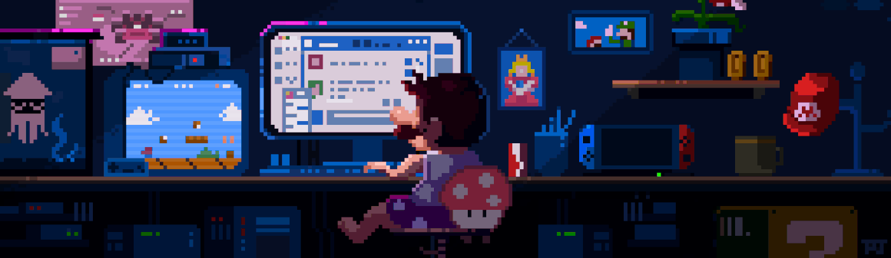

<h1 align="center">
  Hi 👋, I'm Evelyn&nbsp;
</h1>
<h3 align="center">Soon-to-be fullstack developer | IT student @ HAMK</h3>

- 🌱 I’m currently a **third-year IT student** at HAMK, focusing on front-end development.  
- 💻 Skilled in **HTML, CSS, JavaScript, React**, with growing experience in back-end technologies.  
- 🚀 Passionate about building interactive web apps, and open to **internship opportunities** where I can apply and expand my skills.  
- 🎯 Long-term goal: become a **full stack developer** and contribute to innovative projects that make a real-world impact.  
- 📫 Reach me at: **evelynng6165@gmail.com**  

---

<h3 align="left">🌐 Connect with me:</h3>

---

<h3 align="left">💻 Languages and Tools:</h3>

  
  
  
  
  
  
  
  
  
  
  

---

<h2 align="center">📊 GitHub Activity Graph</h2>

  

  
  

